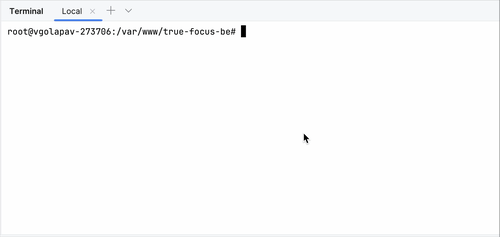

# Go Deploy CLI

[](https://www.gnu.org/software/bash/)
[](https://opensource.org/licenses/MIT)

A command-line deployment utility for Go projects, written in Bash, demonstrating key CLI design principles.

---

## The Problem

In a fast-paced development environment, deploying applications needs to be a repeatable, reliable, and simple process. Manually running a sequence of commands (`git pull`, `go build`, `service restart`) is prone to error and inconsistency across team members. This utility was created to solve that problem by automating the entire workflow into a single, user-friendly command.

## ✨ Key Features

* **Intuitive Flag-Based Controls:** Easily modify the deployment behavior with simple flags like `--skip-git` and `--build-only`.
* **User-Friendly Feedback:** Provides clear, step-by-step output so the user always knows what's happening.
* **Built-in Help Command:** A `--help` command provides instant documentation on how to use the tool.
* **Robust Error Handling:** Gracefully handles unknown options to prevent incorrect usage.
* **Zero Dependencies:** Runs anywhere Bash, Git, and Go are installed.

## 🚀 Demonstration



*Pro-Tip: An animated GIF here will make your project stand out immediately.*

## ⚙️ Prerequisites

Before you begin, ensure you have the following installed:
* [Git](https://git-scm.com/)
* [Go](https://golang.org/) (1.18 or higher)
* `bash`

## 📦 Installation & Setup

1.  Clone the repository to your server or local machine:
    ```sh
    git clone https://github.com/komangsidhiartha/simple-deploy-script.git
    ```
2.  Navigate to the project directory:
    ```sh
    cd simple-deploy-script
    ```
3.  Make the script executable:
    ```sh
    chmod +x deploy.sh
    ```

## 🛠️ Usage

The script is easy to use. Here are the available commands.

**1. Show the help menu**
```sh
./deploy.sh --help
```

**2. Run a full deployment**
(Fetches from git, builds binaries, and restarts the services)
```sh
./deploy.sh
```

**3. Build only**
(Builds the Go binaries but does not restart the services)
```sh
./deploy.sh --build-only
```

**4. Build and restart without pulling from git**
(Skips the `git fetch` and `git checkout` steps)
```sh
./deploy.sh --skip-git
```

**Note:** The script uses `sudo` to restart services. You may be prompted for your password.

## 📄 License

This project is licensed under the MIT License - see the [LICENSE.md](LICENSE.md) file for details.